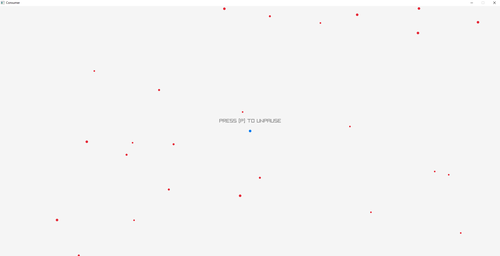
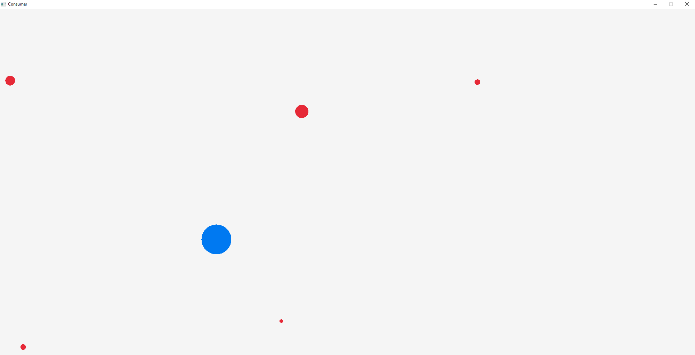
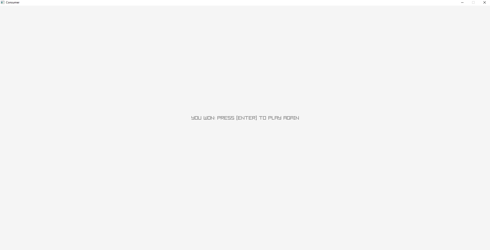
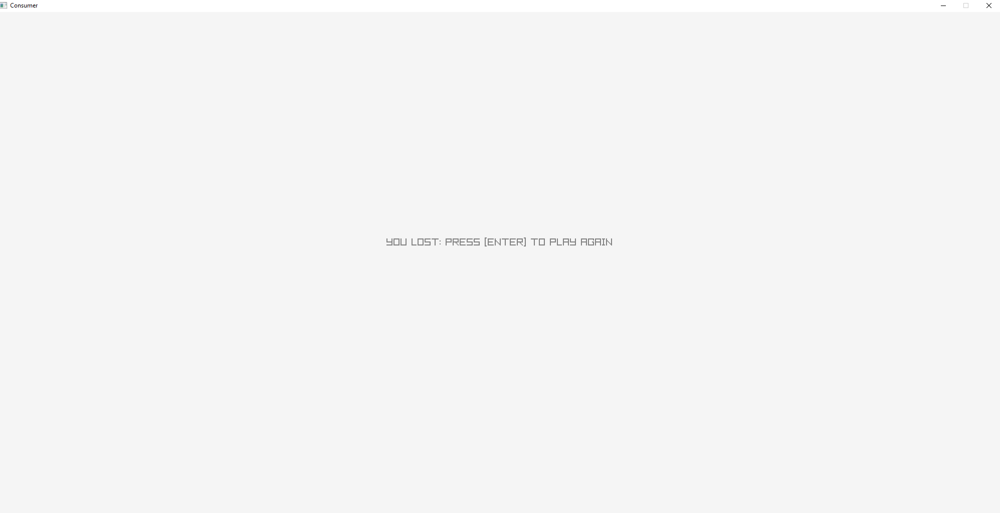

# Consumer

A small project to get my feet wet with game development. This is mainly for testing out the raylib library and see what functionality it offers at a basic level

## Mechanics

The premise of the game is to \"consume\" other dots on the screen. 

* Bigger dots will chase the player and smaller dots. 
* Smaller dots will flee the player and bigger dots.
* Player wins if all red dots are consumed
* Player loses if they are consumed

## Design

* main - handles initialization and game loop
* game - handles the state of all player and enemy entities
* player - handles all player movement logic
* enemy - handles all enemy chase/flee logic
* entity - handles memory allocation of entities and \"consume"\ logic
* collision - handles collision dection and visibility
* constants - contains important constants used for the game

## Screenshots

